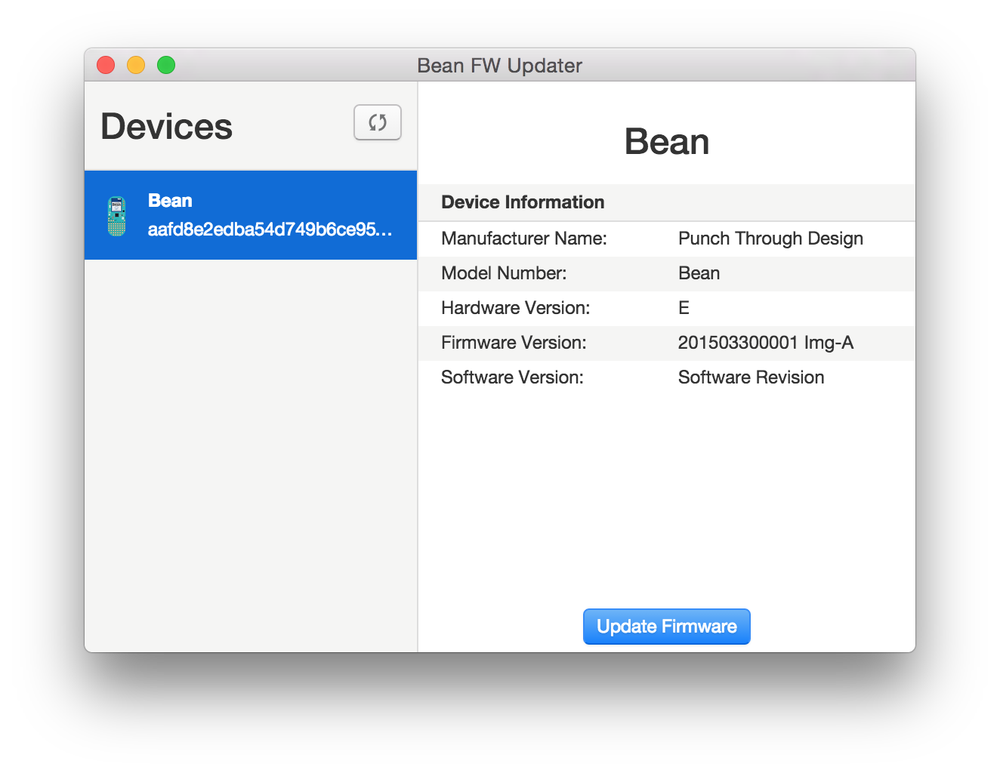

# Bean FW Updater

Stand alone tool for updating Bean FW on desktop platforms



## Development Environment

Install and use Node 0.12.7

```bash
$ nvm install 0.12.7
$ nvm use 0.12.7
```

Build app dependencies:

```bash
$ npm install
```

Build native dependencies against Electrons headers:

```bash
./node_modules/.bin/electron-rebuild
```

__Note:__ This step should be done each time you run `npm install` for _certain_ dependencies...like `noble`...i think?  Not too sure.


## Running

```bash
$ npm run dev
```

## Build and Release

TBD: Need to document how to build and release this bad boy as a binary file, or installer for Windows (and other platforms)

## Platform considerations and API

This projects main priority is building a FW updater that runs on Windows. However, there will be effort made to identify and implement pieces of the code that will be reusable for our long term goal of creating a X-Platform JS SDK. Ideally all of our GUI products (loader, LB explorer) will be consumers of the JS SDK and rewritten in Electron/React-Native.

### TODOs

* API to discover by device name or UUID

## Knowledge Base

* https://github.com/atom/electron/issues/1611
* Electron __Main Procs__ and __Render Procs__ communicate through electrons `ipc` module.
* Reliability issues:
    * Over time the scan results return fewer and fewer devices
    * Can't connect to any device
* Serializing everything over IPC is quite cumbersome ... we already have a really nice object model under `/lightblue` and it's a shame we can't use these objects directly in the frontend (React).  If we plan to use Electron long-term we should come up with a clever, generic way to serialize/de-serialze these objects automatically over the wire so that you can call methods directly and if the object is on the client then it knows to rpc over to the server if it needs to.
