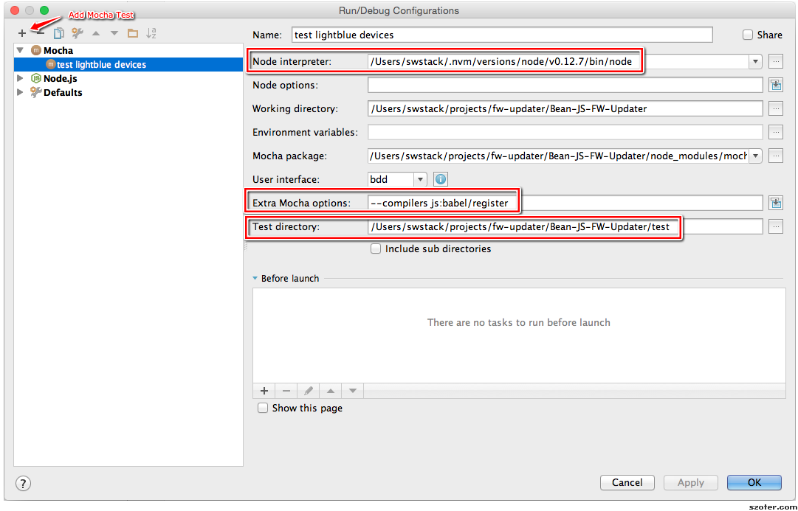

# Cross Platform (X) Bean Loader by Punch Through

This repo contains the source code for the cross-platform Bean Loader by Punch Through. It is based on Node.js and Electron.js. 


## Development Environment

Install and use the Node version specified in `.nvmrc`

```bash
nvm install $(cat .nvmrc) && nvm use
```

Build app dependencies:

```bash
npm install
```

## Running the app

```bash
npm run dev
```

## Running examples

We will use `babel` directly to transpile (to es5) and run the example scripts directly.

Install `babel-cli` and the `es2015` preset.

```
npm install -g babel-cli
npm install babel-preset-es2015
```

Run an example:

```
babel-node examples/<my_example.js>
```

## Testing

The unit test framework we are using is `Mocha` and all of the tests are under the default directory of `test/`.

Run the unit tests from command line:

```
npm run test
```

It is also possible to run the unit tests from WebStorm which can be very helpful as you can set breakpoints and walk through your code. To do this you need to setup a Mocha debug configuration, here is an example:




## Build and Release

Currently we only focus on distributing the app as a binary to Windows. Linux and Mac can run from source for now. 

### Windows

On a Windows computer, do the following.

1. Install [MS Visual Studio 13 express](https://www.microsoft.com/en-gb/download/details.aspx?id=44914)
2. Install [Windows SDK for .NET Framework 4](https://www.microsoft.com/en-us/download/details.aspx?id=8279)
3. Run `npm config set msvs_version 2013 --global`
4. Run `gulp package-win` 

The built distribution can be found as a folder here `build/Bean-FW-Updater-win32-x64`.

## Platform considerations and API

This projects main priority is building a FW updater that runs on Windows. However, there will be effort made to identify and implement pieces of the code that will be reusable for our long term goal of creating a X-Platform JS SDK. Ideally all of our GUI products (loader, LB explorer) will be consumers of the JS SDK and rewritten in Electron/React-Native.

## TODOs

* API to discover by device name or UUID
* Add a command line argument to the gulp task for versioning
* Zip the folder as final task OR wrap the entire dist in an installer

## Knowledge Base

* https://github.com/atom/electron/issues/1611
* Electron __Main Procs__ and __Render Procs__ communicate through electrons `ipc` module.
* Reliability issues:
    * Over time the scan results return fewer and fewer devices
    * Can't connect to any device
* Serializing everything over IPC is quite cumbersome ... we already have a really nice object model under `/lightblue` and it's a shame we can't use these objects directly in the frontend (React).  If we plan to use Electron long-term we should come up with a clever, generic way to serialize/de-serialze these objects automatically over the wire so that you can call methods directly and if the object is on the client then it knows to rpc over to the server if it needs to.
* It seems like `redux` is a superior solution to just `flux` ... let's use it in the future.
* We don't use `;` to terminate lines in ES6. Turn off the WebStorm warnings. Un-check the following option:
    
    > `WebStorm > Preferences > Editor > Inspections > JavaScript > Code style issues > Unterminated statement`

* Sometimes you need to run `./node_modules/.bin/electron-rebuild` to build "native dependencies" against Electron headers.